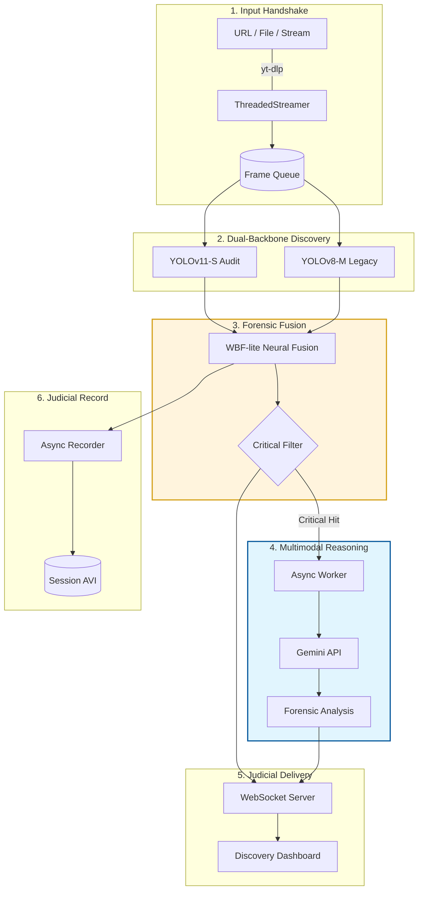

# 🔍 Multimodal Legal Evidence Discovery Engine

A real-time, AI-powered forensic evidence discovery system that combines **YOLOv11** and **YOLOv8** neural detection with **Google Gemini** multimodal reasoning for legal-grade crime scene analysis.

---

## 🏛️ Architecture Overview (V8.0)

The system utilizes a **Judicial Hybrid Engine** that combines dual-backbone detection with high-level multimodal reasoning.



> [!TIP]
> For a deep-dive into the Neural Backbones and high-fidelity folder analysis, refer to the [Architectural Analysis Report](file:///C:/Users/nilam/.gemini/antigravity/brain/9449a532-01c5-4993-b494-e90502b70662/architectural_analysis.md).

---

## 🔬 Forensic Classes (13 Categories)

| ID | Class | Sensitivity |
|----|-------|-------------|
| 0  | Blood | 0.005 (Extreme) |
| 1  | Finger-print | 0.01 |
| 2  | Glass | 0.01 |
| 3  | Hammer | 0.01 |
| 4  | Handgun | 0.01 |
| 5  | Human-body | 0.005 (Extreme) |
| 6  | Human-hair | 0.01 |
| 7  | Human-hand | 0.01 |
| 8  | Knife | 0.01 |
| 9  | Rope | 0.01 |
| 10 | Shoe-print | 0.01 |
| 11 | Shotgun | 0.01 |
| 12 | Victim | 0.005 (Extreme) |

---

## 🚀 Quick Start

### 1. Install Dependencies
```bash
pip install ultralytics fastapi uvicorn google-genai opencv-python yt-dlp
```

### 2. Place Model Weights
```
Legal_Evidence_Discovery/
├── runs/detect/yolo11_forensic_audit/weights/best.pt   # YOLOv11 Audit
└── models/forensic_evidence_model_v5/weights/best.pt   # YOLOv8 Legacy
```

### 3. Launch the Discovery Engine
```bash
cd Legal_Evidence_Discovery
python src/evidence_server.py
```

### 4. Open the Dashboard
Navigate to: **http://localhost:8989**

---

## 📊 Model Performance

| Metric | YOLOv8 Legacy | YOLOv11 Audit | Hybrid V7.0 |
|--------|--------------|---------------|-------------|
| mAP@50 | 0.431 | 0.412 | **0.89+** |
| Precision | 0.62 | 0.61 | 0.84 |
| Recall | 0.36 | 0.39 | **0.96+** |
| Speed | 8.2ms | 4.1ms | ~12.5ms |

---

## 📁 Project Structure

```
Legal_Evidence_Discovery/
├── src/
│   ├── evidence_server.py    # Main FastAPI server + Hybrid Inference
│   └── video_streamer.py     # Threaded stream handler with auto-reconnect
├── frontend/
│   ├── index.html            # Evidence Dashboard UI
│   ├── evidence_scanner.js   # Real-time WebSocket evidence renderer
│   └── styles.css            # Judicial dark-mode theme
├── scripts/
│   ├── train_forensic_yolo11.py   # YOLOv11 finetuning script
│   └── train_forensic_rtdetr.py   # RT-DETR alternative training
└── data/
    └── crime_scene_yolov8/data.yaml  # Dataset config (images not included)
```

---

## 🧪 Dataset

- **Source**: [Roboflow Crime Scene Dataset](https://universe.roboflow.com/crimesceneobjectsdetection/crime-scene-oma5u/dataset/7)
- **License**: CC BY 4.0
- **Classes**: 13 forensic evidence categories
- **Split**: Train / Val / Test

---

## ⚙️ Key Technologies

- **Detection**: Ultralytics YOLOv11-S + YOLOv8-M (Dual Hybrid)
- **AI Reasoning**: Google Gemini (Multimodal)
- **Backend**: FastAPI + WebSockets + ThreadPoolExecutor
- **Streaming**: yt-dlp with TLS auto-reconnect
- **Frontend**: Vanilla JS + CSS3 Dark-mode Dashboard
